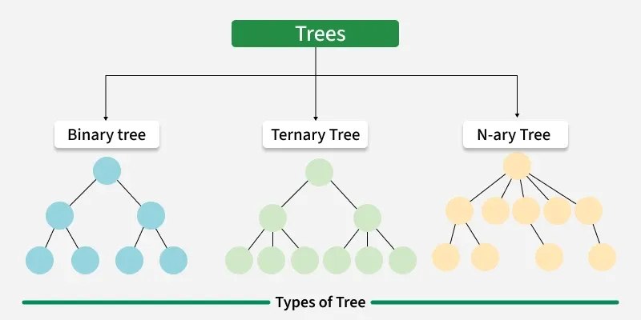
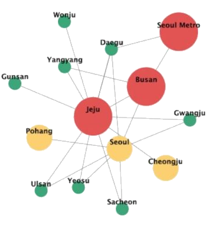
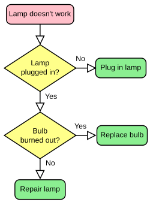
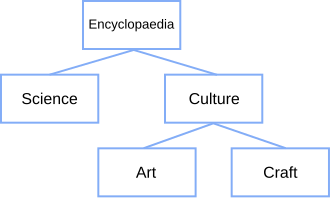

# Journey

A UI/UX experiment in visual, branching browser history.

_“The journey is the reward.”_  
**Lao Tzu**

SCREENSHOT

**Journey** is a **C# WPF** user control which aims to provide the ability to view your browsing history as an interactive tree diagram.

This repo contains the following projects:

Project            | Description
-------------------|------------
**Journey**        | An implementation of the **Journey** concept. `JourneyWebView2` implements `IWebView2`, and internally wraps a `WebView2` instance.
**JourneyBrowser** | A minimal "browser" implementation that uses the `JourneyWebView2` control to demonstrate the **Journey** concept.

`JourneyWebView2` _should_ be a drop-in replacement for `WebView2`, but it is only a proof-of-concept so _caveat emptor_...

## Abstract

**Journey** is an experiment into whether there could be a better - or at least more visually informative - way of presenting a users short-term browsing history. The end result is a branching, tree-based record of a users per-tab browsing history, which aims to seamlessly integrate into the browser user interface, be intuitive and easy-to-use, and visually delight the user.

## Definitions

- _**browser:**_ a software application with a graphical user interface for displaying, and navigating between, web pages

- _**browsing area:**_ the area of the browser in which web content is displayed, typically the area below the address bar, and which does not include the browser UI

- _**history:**_ the typical history feature presented to the user that displays a list of all pages visited, across all tabs and sessions, usually with a date and time stamp, and often with the ability to search for specific pages

- _**session:**_ the period of activity that starts when a user opens a browser window or tab, and ends when they close it

- _**travellog:**_ the short-term history associated with a page or tab within a browser that allows for navigation backwords and forwards, sometimes referred to internally within a browser as the session history

## Introduction

A typical use case for a browser is to use a search engine to find the solution to a problem, which a user will often do by initiating a search in their browser and then clicking on links that appear in the search results. The user may click on several links, returning to the search results between each link, and repeat this for a number of iterations. In doing this, the user can end up in a situation whereby they have visited a number of pages, but are unable to remember which page contained the most helpful solution to their problem.

The situation can be further compounded if several results lead to different answers on the same web site, resulting in many of the pages having similar URLs and titles. The user may be forced to return to the search results and click on each link again, or use the history feature of their browser to attempt to find the page they were looking for. This can be both time consuming and frustrating, especially if the user has visited a number of pages within a short period of time.

This scenario naturally posits the question, _"could the travellog be more helpful in such scenarios?"_ Whilst there are already a number of tools and extensions to enhance the history of a browser [^better-history] [^browser-history-plus] [^history-plus], at the time of this project there appears to be no tool or extension that enhances the travellog.

As a result, this project proposes a way of enhancing the travellog, allowing users to see it in a more visual way, which shows the organic path they took when visting pages. This enhanced travellog allows users to see all of the pages they have visited within their _session_, representing the "journey" they have taken from when the session started until the page they are presently on. Based on this idea, the proposed enhanced travellog tool has been named **Journey**.

## Goals

The following goals were identified for **Journey**:

- **Structured**

  The tool should represent the users browsing travellog as a visual structure, with each page visited represented as an item within the structure.

- **Visual**

  The tool should be a "visual tool"; visual elements, such as images or animations, should be used to aid the user in using the tool.

- **Interactive**

  The tool should be interactive, allowing the user to navigate between previously visited pages by interacting directly with the tool.

- **Intuitive**

  The tool should be easy to use, and not require any additional training or documentation to use.

- **Consistent**

  The tool should follow the same interactivity principles as the browser; that is, elements such as mouse cursors, shortcut keys, and means of interacting with elements should be consistent between viewing a web page and viewing the travellog.

- **Seamless**

  The tool should integrate seamlessly into the users browser interface, and not require any additional steps to use, other than a way of invoking the tool.

- **Performant**

  The tool should be performant, and not slow down the users browsing experience.

## Research

### Data Structure

The data for the users **Journey** consists of a series of pages visited (_nodes_), each one linked to the page that came before it (_parent_) and to the pages that came after it (_children_). Each page can have multiple _children_, given that the user can navigate backwards and forwards through their travellog at any time, resulting in branches in their navigation history. Therefore, **Journey** moves beyond storing data as a simple list, as existing travellogs do.

According to _Adrian Rusu_: [^tree-drawing-algorithms]

> "The typical data structure for modeling hierarchical information is a tree whose vertices represent entities and whose edges correspond to relationships between entities."

It becomes clear that our data lends itself naturally to a tree data structure, whereby our _nodes_ form a hierachy, with each _node_ representing a page the user has visited, and the relationships between _parent_ and _child_ nodes representing the chronology in which the pages have been visited. 

It must be noted however, that this chronology is limited only to the order that links were followed from each page, and not to the times that they were followed; the depth of nodes within the tree does not indicate order.

For example, if the user navigates back from a page that has a depth of 10 (is 10-levels deep within the tree) to a page that has a depth of 2, and then visits a new page, that new page will have a depth of 3 even though it was visited after the page with a depth of 10. This illustrates how depth cannot be used to determine the order in which pages were visited in relation to other nodes within the tree.

At a high-level there are three types of defined tree structure, with various further specialisations within each type; **binary tree**, **ternary tree**, and **n-ary tree**. These are illustrated below:

  
_Types of trees_ [^types-of-trees]

As each node in our tree structure could have any number of child elements, an _n-ary tree_ (also known as a _general tree_) will be used to store the users **Journey**.

### Visualisation

When it comes to visualising tree structures, _Adrian Rusu_ goes on to state: [^tree-drawing-algorithms]

> "Visualizations of hierarchical structures are only useful to the degree that the associated diagrams effectively convey information to the people that use them. A good diagram helps the reader understand the system, but a poor diagram can be confusing."

Much of the value of a tree structure is in how easily it's information can be conveyed to the viewer; if a tree is visualised poorly, it's information may be hard to discern or, worse, incorrectly interpreted. It is therefore essential that the tree structure is presented in a clear and logical fashion

There are many ways in which tree structures can be visualised but, after briefly considering many types of visualisation, we find that only three are suitable for further consideration; **network graph**, **flowchart**, and **tree diagram**.

#### Network Graph

> "A network graph is a chart that displays relations between elements (nodes) using simple links. Network graph allows us to visualize clusters and relationships between the nodes quickly..." [^network-graph]

  
_An example of a network graph_ [^network-graph]

When considered more closely, we can see that network graphs offer a level of complexity beyond the needs of this project; multiple links between nodes, and multiple parent nodes are some of the features that can be achieved with a network graph that are beyond our requirements.

Further, the typical arrangement for a network graph, as shown in the diagram above, is not effective at visually relaying the chronology of nodes - it is hard to see in the diagram which node comes first, as there is no natural visual starting point, and the "random" nature of the layout does not asist the user visually in determing how links have been followed.

Instead, the visualisation has a stronger focus on the relationships between nodes. Given that our requirements are to illustrate the users browsing "flow", moving from one page to the next, we can see that _network graphs_ are not the appropriate visualisation for this project.

#### Flowchart

> "A flowchart is a type of diagram that represents a workflow or process. A flowchart can also be defined as a diagrammatic representation of an algorithm, a step-by-step approach to solving a task." [^flowchart]

  
_An example of a flowchart_ [^flowchart]

Initially flowcharts appear a strong match for the requirements of the project, effective at conveying both a starting point and a natural chronology. However, we find that flowcharts present nodes in the "present tense"; that is, as a series of _decisions_ (diamond shaped nodes), showing choices a user _can_ make, and their possible outcomes, _processes_ and _terminals_ (rectangular and rounded rectangular nodes respectively).

This means that flowcharts are more suited to showing a process that can be followed, with the user making choices at each step, rather than showing a record of choices already made. In the case of **Journey**, we are not looking to show possible decisions, as decisions are simply the available links on each page, and so we find that _flowcharts_ are also not the appropriate visualisation for this project.

#### Tree Diagram

> "A tree structure, tree diagram, or tree model is a way of representing the hierarchical nature of a structure in a graphical form. It is named a "tree structure" because the classic representation resembles a tree, although the chart is generally upside down compared to a biological tree, with the "stem" at the top and the "leaves" at the bottom." [^tree-structure]

  
_An example of a tree diagram_ [^tree-structure]

Tree diagrams are a common way of representing hierarchical structures, and are often used for representing data with sub-data, such as categories and sub-categories, as shown in the diagram above. They are also excellent for representing chronological relationships between choices, with a root node representing the initial starting point, and each branch representing the outcome of different choices. In this way they are similar to flowcharts, but without the "present tense" nature of flowcharts, whereby each decision is also represented.

They also meet our requirement of effectively conveying information, with a natural flow from the root node downwards, and a clear visual representation of the hierarchy of nodes. We can see that this makes them ideal for representing the users **Journey**, and thus the most appropriate visualisation for this project.

### Tree Layout

When creating a tree diagram there are challenges around how to arrange nodes in a performant manner that is both visually pleasing, and without any node collisions or overlaps. Thankfully this is a field that has been well studied, with numerous algorithms [^tree-drawing-algorithms] having been created.

For this project we will be working with a _layered_ tree, whereby all nodes of the same depth are visually drawn on the same "row". This is a common way of drawing trees, often referred to as _tidy trees_, and Wetherell and Shannon [^tidy-drawings] presented the first O(n) algorithm for drawing them in 1979, along with formalising three aesthetic rules for tree layout. Reingold and Tilford [^tidier-drawings] then continued this work, and in 1981 improved the algorithm and added a fourth aesthetic rule.

Whilst much work has since been done in this area, such as by Walker [^walker], and Buchheim, Jünger, and Leipert [^buchheim], we find that the Reingold-Tilford algorithm continues to be one of the most popular and widely used for drawing tidy trees, and appropriate for the tree structures we will be drawing for this project.

### Beautiful and Usable

**Journey** was conceived as a UI/UX experiment, and from the very beginning both usability and aesthetics have been at the very core of the project. However, given that the goal of the project is to determine whether there is feasibility in enhancing the travellog with a branching structure, should we focus or prioritise one of either usability or aesthetics over the other? If we focus on one area to the detriment of the other, will the perceived usefulness of the tool be diminished?

In a study by Tractinsky et al, they found that a more visually appealing interface was perceived as more usable, even if the interface was not _actually_ more usable.

> "This study demonstrated once again the tight relationships between users' initial perceptions of interface aesthetics and their perceptions of the system's usablity. Moreover, we showed that these relations endure even after actual use of the system." [^beautiful]

The findings of this paper are summarised under the notion _"What is beautiful is usable"_, and have been repeated in many other studies, with Hassenzahl and Monk performing:

> "...a review of 15 papers reporting 25 independent correlations of perceived beauty with perceived usability..." [^hassenzahl]

However, there have also been studies into the counter-argument of _"What is usable is beautiful"_, with Tuch et al finding that:

> "...Tractinsky’s notion ("what is beautiful is usable") can be reversed to a "what is usable is beautiful" effect under certain circumstances." [^usable]

Hamborg et al explored this counter-argument further and ultimately concluded that both usability and aesthetics are important to the end user experience:

> "Concerning user experience design, results indicate that both usability and aesthetics contribute to a positive noninstrumental valuation of a system in terms of the ability of a system to communicate a desirable identity to others (HQI) and perceived appeal." [^hamborg]

From these studies we can conclude that attention must be given to both the usability of the tool, but also the visual presentation; a tool that is not visually appealing may be perceived as less usable, and a tool that is difficult to use will connote negative reactions from users.

### Consistency

Consistency was already highlighted as a goal for the project, but knowing _how_ important consistency is to the user experience wil ultimately influence the design of the tool.

"Consistency and standards" are the fourth of Jakob Nielsen's ten heuristics:

> "Users should not have to wonder whether different words, situations, or actions mean the same thing. Follow platform and industry conventions." [^consistency]

This is expanded upon by Rachel Krause (from Jakob Nielsen's Nielsen Norman Group):

> "To be easy to learn and use, systems should adhere to both internal and external consistency — they should use the same patterns everywhere inside the system and should also follow web-, platform-, and domain-specific conventions." [^consistency-and-standards]

We see that consistency is key to a positive user experience, and that it is important to follow both internal and external conventions. Within the scope of this project our main focus will be on internal consistency, as conceptually the completed tool would be used within a browser.

> "Internal consistency relates to consistency within a product or a family of products, either within a single application or across a family or suite of applications." [^consistency-and-standards]

Our expectation is that if we maintain internal consistency with the browser we are within, external consistency _should_ be provided for us, as the browser should already follow external conventions.

## Design

The initial project goals can be refined through the research undertaken, and both can be used to inform the design of **Journey**. Using the _MoSCoW_ [^moscow] method, the final design requirements are as follows:

### Structured

- A _general tree_ **must** be used to store the users travellog, given that a user may visit any number of pages after any other page during a browsing session.

- The root node of the tree structure **must** represent the initial page visited by the user for that browser tab or window.

- Each subsequent page visited **must** be represented as a child node of the previous page.

- Each page within the travellog **must** be represented equally within the tree; that is, each node should be of the same size and design.

### Visual

- Each page visited **must** be represented by a thumbnail image of the page _at the point at which it was navigated away from_; this is to vsually aid the user by showing each page as it was when the user last interacted with it.

- Each page visited **must** show the title of the page.

- Each page visited **must** show the URL of the page.

- Connections **should** be shown to illustrate the flow of travel between pages.

### Interactive

- The user **must** be able to interact with the tree structure by clicking on any node within the tree.

- The user **must** be able to pan around the tree structure.

- The user **should** be able to scroll the tree structure.

- The user **should** be able to zoom in and out of the tree structure.

### Consistent

- Interacting with elements **must** be achieved by clicking the left mouse button.

- Scrolling the mouse wheel "down" (towards the user) **should** move visual elements "up" (towards the top of the screen), and the inverse **should** apply accordingly.

- When a modifier key is held, scrolling the mouse wheel "down" (towards the user) **should** zoom out, and the inverse **should** apply accordingly.

- The CTRL key **should** be used as the modifier key for zooming.

- When clicking an interactive element results in a navigation action, the mouse cursor **should** change to a pointer hand.

### Intuitive

- Pressing the ESC key **must** close the travellog and return the user to their current page.

- When the user views the travellog, the current page **should** be highlighted in the tree structure to illustrate their current browsing "position".

### Seamless

- The travellog **must** appear within the browsing area of the users current browser tab or window.

- The current page **must** transition into the travellog, to visually illustrate to the user the link between their current page and the travellog.

- When the user selects a page, the travellog **must** transition back into the selected page, to visually illustrate to the user the link between their action and the result.

### Performant

- Browsing performance **must** not be impacted by the tool being available within the browser.

- The tool **must** remain performant when being used, ideally with no lag or delay when interacting with the tree structure.

- The tool **must** use as little memory as possible, such as for storing travellog information.

- The tool **should** transition in and out of the browsing area quickly, and not cause any noticeable lag or delay.

- The tool **should** not consume any CPU cycles when not being used.

## Implementation

Due to familiarity with the development environment, and the ability to rapidly develop and iterate on the design, the tool is implemented in **C#** and **WPF**.

The scope of the project is not to develop an entire browser, but rather to enhance the existing browsing experience, so our implementation is a user control that could conceptually be used within an existing browser application. This allows us to focus solely on the implementation of the **Journey** concept, and not on the complexities of building a full browser application.

### WebView2

We leverage work already done in the browser space and utilise a `WebView2` [^webview] control as the basis of our user control. In order to provide a seamless transition between a web page and the **Journey** view, we implement our user control as a custom control that wraps a `WebView2` instance. This allows us to display the users branching travellog within the same visual space as the browsing area of the users current browser tab or window.

By also implementing the `IWebView2` interface on our user control, it _should_ mean that the final implementation can be used as a drop-in replacement for a `WebView2` control.

### Tree Structure

**Journey** implements a simple, generic tree structure in **C#**, representing a strongly typed collection of objects that can be traversed as a tree; each node contains a strongly type object, and can have 0 or more child nodes. Each node also provides methods and properties for traversal and information.

In order to optimise traversal of the tree (in anticipation of node positioning) we calculate all node properties at the point of insertion or removal; whenever a child node is added or removed, the parent node (and all cascading child nodes) have their properties updated to reflect the change. This allows us to quickly traverse the tree and access properties such as depth, height, and number of children without having to recalculate them each time, but at the expense of a small increase in memory usage, and a slightly longer insertion and removal time.

### Reingold-Tilford Algorithm

Our tree visualisation is arranged using the Reingold-Tilford algorithm [^tidier-drawings]. A detailed explanation of the algorithm was provided by _Kay Jan Wong_ [^rt-walkthrough], but a special mention must be given to _Rachel Lim_ [^rt-rachel], whose implementation was used as the basis of the implementation in this project.

### Journey Browser

Although Journey is an `IWebView2` control, in order to test the effectiveness of the final implementation we also create a browser to host the control in, given the monicker _Journey Browser_.

_Journey Browser_ is enough of a browser to be sufficiently "transparent" to the end user compared to their regular browser, but kept simple enough that it is fairly quick to implement. It is again implemented in **C#** and **WPF**, using some basic MVVM [^mvvm], and leveraging **LottieSharp** [^lottiesharp] for the introduction animation, and **Dragablz** [^dragablz] for the tab control. The only features implemented are _Back_, _Forward_, _Home_, _Refresh_, and _Light/Dark Mode_.

## Challenges

### WebView2 History

`WebView2` does not provide programmatic access to the travellog, other than being able to navigate backwards or forwards. It also does not allow for manipulation of the travellog, or the ability to change entries that are in the stack.

At the time of this project, the only way to access the full travellog is using the Chrome DevTools Protocol [^devtools-protocol], which provides a way of obtaining the entire history and which entry the user is currently on. [^navigation-history] There is no way to manipulate the history however, although it is a requested feature. [^travellog-api]

Without the ability to manipulate the history for a browser session, our design has to change to accomodate what we can achieve. Previously, the concept was that the user could click on any node in the browsing tree and navigate to the respective page. As part of that navigation, we would replace the travellog within the browser to reflect the users current position.

However, although we could still navigate to any page the user clicks in the tree, we are unable to control how that navigation would appear in the travellog - any page in the tree that was navigated to that wasn't currently in the browser travellog would appear as a new navigation, and therefore as a new child node of the current page, rather than changing the current page to an existing node.

Our design therefore adapts to accomodate this technical restriction as follows:

- All nodes that are within the browsers travellog will be referred to as the _active path._

- Navigating to any node within the _active path_ will work as expected, with the current page changing to the selected node.

- All nodes that are not in the _active path_ will be referred to as _archived_.

- Navigating to any _archived_ node will open that page in a new tab.

### Airspace Issues

Airspace problems have been generally present in WPF for a long time [^airspace], and `WebView2` had an issue opened for airspace problems in 2020 [^airspace-wpf], although the issue was recently closed with the introduction of the `WebView2CompositionControl` [^webview2compositioncontrol]. 

The airspace problems make visually integrating the wrapped `WebView2` control harder - we cannot overlay elements on the top of the control, or fade/transition to/from the control as easily. This impacts the visual appearance of our implementation, and how we can seamlessly transition from the browser view to the **Journey** view.

Although wrapping a `WebView2CompositionControl` would make visual integration easier, it does come with limitations:

> "Note that the WebView2CompositionControl uses a GraphicsCaptureSession to capture the screen content from the underlying browser processes. As such, you may experience lower framerates compared to the standard WebView2 control, and DRM protected content will fail to play or display properly." [^webview2compositioncontrol]

By wrapping a `WebView2CompositionControl` we would possibly incur lower framerates when browsing web pages, and restrict access to content protected by DRM. This violates our goals regarding performance and seamless integration, and prevents **Journey** from being a drop-in `WebView2` replacement.

Instead we continue to wrap the standard `WebView2` control, and modify our implementation to work around the airspace problem. This restricts us from implementing effects such as fading the browsing area into the **Journey** view, but by quickly switching from the wrapped `WebView2` control to an image snapshot we achieve very similar visual fidelity.

## Feedback

The completed implementation of **Journey** was used to gather feedback from users and evaluate both the design against the goals, and whether the tool was a useful addition to the users browsing experience.

A selection of feedback is given below:

## Future Work

### History Access

Although the restrictions around travellog access have been mitigated, the tool would be improved with full access to the travellog, and the ability for users to navigate to any page within the **Journey** tree. If the open issue [^travellog-api] is ever resolved, the tool could be updated accordingly.

### Tree Manipulation

The current implementation does not allow the **Journey** travellog tree to be modified. A future improvement could allow for nodes to be removed from the tree, also removing all child nodes.

### Right-hand Alignment

The _active path_ within the **Journey** tree will always consist of the right-most nodes of the tree. To make this easier for the user to see, we could update the tree layout algorithm to "right-align" the tree, so the active path was a series of nodes all within a single column, with all branches appearing as nodes to the left.

### Memory Pressure

Although there is no empirical data to validate, there are concerns that a very large number of pages in the history could consume a large amount of memory as full-size image snapshots are captured for each page.

There are two mitigations that could be implemented to potentially relieve memory pressure:

- For all nodes in the tree that are classed as _archived_, the snapshots could be reduced in both size and quality to reduce their memory consumption. Only nodes in the _active path_ will be animated back to "full screen", so only these nodes need full size images.

- Page snapshots could be offloaded to disk, and retrieved whenever **Journey** is shown. The snapshot for the current page is always generated whenever the tool is invoked, and the remaining snapshots could be pulled from disk, loading and appearing asynchronously so as not to impact the performance of the tool.

## Conclusion

Though only a proof-of-concept, I hope that this project was interesting, and I would love to hear any feedback!

## Acknowledgements

Journey icon created by [Freepik - Flaticon](https://www.flaticon.com/free-icon/customer-journey_4598796)

Other icons created by [Google Fonts](https://fonts.google.com/icons)

Lottie animation created by [shivani bai](https://lottiefiles.com/free-animation/travel-is-fun-IYcVDUVlkE)

Reingold-Tilford implementation adapted from the work of [Rachel Lim](https://rachel53461.wordpress.com/2014/04/20/algorithm-for-drawing-trees/)

[^better-history]: [BetterHistory.io](https://betterhistory.io)

[^browser-history-plus]: [Browser History Plus](https://browserhistory.net)

[^history-plus]: [HistoryPlus](https://chromewebstore.google.com/detail/history-plus/kloodnjmhgicecceindgbfpjencnhajh)

[^tree-drawing-algorithms]: [Tree Drawing Algorithms](https://cs.brown.edu/people/rtamassi/gdhandbook/chapters/trees.pdf), mirrored [here](res/pdf/trees.pdf)

[^types-of-trees]: [Types of trees in data structures](https://www.geeksforgeeks.org/types-of-trees-in-data-structures/)

[^network-graph]: [Network graph](https://www.highcharts.com/blog/tutorials/network-graph/)

[^flowchart]: [Flowchart](https://en.wikipedia.org/wiki/Flowchart)

[^tree-structure]: [Tree structure](https://en.wikipedia.org/wiki/Tree_structure)

[^tidy-drawings]: [Tidy Drawings of Trees](https://www.researchgate.net/publication/3189258_Tidy_Drawings_of_Trees), mirrored [here](res/pdf/Tidy_Drawings_of_Trees.pdf)

[^tidier-drawings]: [Tidier Drawings of Trees](https://reingold.co/tidier-drawings.pdf), mirrored [here](res/pdf/tidier-drawings.pdf)

[^walker]: [A Node-Positioning Algorithm for General Trees](https://www.cs.unc.edu/techreports/89-034.pdf), mirrored [here](res/pdf/89-034.pdf)

[^buchheim]: [Improving Walker's Algorithm to Run in Linear Time](https://www.researchgate.net/publication/30508504_Improving_Walker's_Algorithm_to_Run_in_Linear_Time), mirrored [here](res/pdf/Improving_Walker's_Algorithm_to_Run_in_Linear_Time.pdf)

[^beautiful]: [What is beautiful is usable](https://www.ise.bgu.ac.il/faculty/noam/papers/00_nt_ask_di_iwc.pdf), mirrored [here](res/pdf/00_nt_ask_di_iwc.pdf)

[^hassenzahl]: [The Inference of Perceived Usability From Beauty](https://www.researchgate.net/publication/233864572_The_Inference_of_Perceived_Usability_From_Beauty), mirrored [here](red/pdf/HassenzahlMonk-2010-TheInferenceofPerceivedUsabilityFromBeauty.pdf)

[^usable]: [Is beautiful really usable? Toward understanding the relation between usability, aesthetics, and affect in HCI](https://cpb-us-e1.wpmucdn.com/wp.wwu.edu/dist/8/2868/files/2018/04/Tuch-et-al-2012-Is-Beautiful-Usable-2don1em.pdf), mirrored [here](res/pdf/Tuch-et-al-2012-Is-Beautiful-Usable-2don1em.pdf)

[^hamborg]: [The Interplay between Usability and Aesthetics: More Evidence for the "What Is Usable Is Beautiful" Notion](https://onlinelibrary.wiley.com/doi/full/10.1155/2014/946239?msockid=192a01f978e06fe63aea12f079576e44), mirrored [here](res/pdf/Hamborg.pdf)

[^consistency]: [10 Usability Heuristics for User Interface Design](https://www.nngroup.com/articles/ten-usability-heuristics/)

[^consistency-and-standards]: [Maintain Consistency and Adhere to Standards (Usability Heuristic #4)](https://www.nngroup.com/articles/consistency-and-standards/)

[^moscow]: [MoSCow Methods](https://en.wikipedia.org/wiki/MoSCoW_method)

[^webview]: [WebView2](https://learn.microsoft.com/en-us/microsoft-edge/webview2/)

[^rt-walkthrough]: [Reingold Tilford Algorithm Explained With Walkthrough](https://towardsdatascience.com/reingold-tilford-algorithm-explained-with-walkthrough-be5810e8ed93/)

[^rt-rachel]: [Algorithm for Drawing Trees](https://rachel53461.wordpress.com/2014/04/20/algorithm-for-drawing-trees/)

[^mvvm]: [Patterns - WPF Apps With The Model-View-ViewModel Design Pattern](https://learn.microsoft.com/en-us/archive/msdn-magazine/2009/february/patterns-wpf-apps-with-the-model-view-viewmodel-design-pattern)

[^lottiesharp]: [LottieSharp](https://github.com/quicoli/LottieSharp)

[^dragablz]: [Dragablz](https://github.com/ButchersBoy/Dragablz)

[^devtools-protocol]: [Chrome DevTools Protocol](https://chromedevtools.github.io/devtools-protocol/tot/)

[^navigation-history]: [Page.getNavigationHistory](https://chromedevtools.github.io/devtools-protocol/tot/Page/#method-getNavigationHistory)

[^travellog-api]: [Expose programmatic access to the travellog](https://github.com/MicrosoftEdge/WebView2Feedback/issues/1093)

[^airspace]: [Mitigating Airspace Issues In WPF Applications](https://dwayneneed.github.io/wpf/2013/02/26/mitigating-airspace-issues-in-wpf-applications.html)

[^airspace-wpf]: [When using Webview2 in WPF, unable to overlay WPF controls on the Webview](https://github.com/MicrosoftEdge/WebView2Feedback/issues/286)

[^webview2compositioncontrol]: [WebView2CompositionControl Class](https://learn.microsoft.com/en-us/dotnet/api/microsoft.web.webview2.wpf.webview2compositioncontrol)